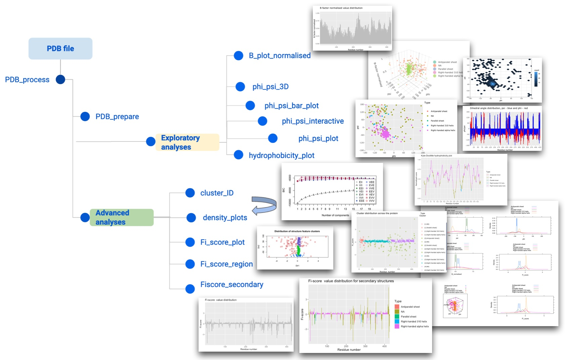

# Summary

`Fiscore` is an R package developed to quickly take advantage of protein topology and conformational feature assessment and perform various exploratory analyses or integrate derived scores into relational databases as well as machine learning pipelines. The package builds on protein structure and topology studies which led to the derivation of the Fi-score, or mathematical equation, that captures dihedral angle and B-factor parameter influence on amino acid residues in a protein. Since target evaluation is paramount for rational therapeutics development, there is an undeniable need for specialised analytical tools and techniques that can be used in R&D or academic research. For example, to successfully engineer therapeutic antibodies, it is necessary to characterise potential binding or contact sites on target proteins. Moreover, translating structural data into parameters that can be used to classify targets, store target-ligand information, or develop machine learning applications could significantly improve our ability to assess new targets and develop novel therapeutics. As a result, `Fiscore` package  was developed to aid with therapeutic target assessment and make machine learning techniques more accessible to a wider scientific audience.

# Statement of Need

Lack of bioinformatics tools to quickly assess protein conformational and topological features motivated to create an integrative and user-friendly R package. Moreover, `Fiscore` package implements a pipeline for Gaussian mixture modelling making such machine learning techniques readily accessible to non-experts. This is especially important since probabilistic machine learning techniques can help with a better interpretation of complex biological phenomena, especially when it is necessary to elucidate various structural features that might play a role in protein function. Thus, `Fiscore` package builds on the mathematical formulation of protein physicochemical properties that can aid in drug discovery, target evaluation, or relational database building. In addition, the package provides interactive environments to explore various features of interest. Finally, one of the goals of this package was to engage structural bioinformaticians and develop tools that could help researchers not necessarily specialising in this field.The package `Fiscore` (v.0.1.2) is distributed via CRAN [@CRAN] and Github [@Fiscore].

# Introduction

`Fiscore` R package was developed to quickly take advantage of protein topology/conformational feature assessment and perform various analyses allowing a seamless integration into relational databases as well as machine learning pipelines [@Kanapeckaitė:2021]. The package builds on protein structure and topology studies which led to the derivation of the Fi-score equation capturing protein dihedral angle and B-factor influence on amino acid residues [@Kanapeckaitė:2021]. The introduced tools can be very beneficial in rational therapeutics development where successful engineering of biologics, such as antibodies, relies on the characterisation of potential binding or contact sites on target proteins [@Kanapeckaitė:2021; @Du:2020]. Moreover, translating structural data features into scores can help with target classification, target-ligand information storage, or integration into machine learning pipelines [@Kanapeckaitė:2021; @Du:2020]. As a result, Fi-score, a first-of-its-kind *in silico* protein fingerprinting approach, created a premise for the development of a specialised R package to assist with protein studies and new therapeutics development [@Kanapeckaitė:2021]. 

`Fiscore` package allows capturing dihedral angles and B-factor effects on the protein topology and conformation. Since these physicochemical characteristics could help with the identification or characterisation of a binding pocket or any other therapeutically relevant site, it is important to extract and combine data from structural files to allow such information integration [@Kanapeckaitė:2021; @Fauman:2011; @Faraggi:2009]. Protein dihedral angles were selected as they contain information on the local and global protein conformation where protein backbone conformation can be highly accurately recreated based on the dihedral angles [@Kanapeckaitė:2021; @Faraggi:2009]. Moreover, since Ramachandran plot, which plots φ (phi) and ψ (psi) angle distributions for individual residues, allows only a holistic description of conformation and cannot be integrated with traditional parametric or non-parametric density estimation methods, a specific transformation was required to use this data. An additional parameter, namely the oscillation amplitudes of the atoms around their equilibrium positions (B-factors) in the crystal structures, was also used.  B-factors contain a lot of information on the overall structure; for example, these parameters depend on conformational disorder,  thermal motion paths, associations with the rotameric state of amino acids side-chains, and they also show dependence on the three-dimensional structure as well as protein flexibility [@Kanapeckaitė:2021; @Faraggi:2009]. Normalised dihedral angles (standard deviation scaling to account for variability) and scaled B-factors (min-max scaling) (Eq.1) were integrated into the Fi-score (Eq.2). It is important to highlight that B-factors need to be scaled so that different structural files can be compared and the dihedral angle normalisation transforms angular data into normalised values based on the overall variability [@Kanapeckaitė:2021].

$B_{norm}= \frac{B_{i}-B_{min}}{B_{max}-B_{min}}$

**Equation 1**. Min-max normalisation and scaling of B-factor where Bi-norm is scaled B-factor, Bi - B-factor for Cα, Bmax - largest B-factor value for the total protein B-factors for all Cα, Bmin - smallest B-factor value for the total protein B-factors for all Cα. B-factor normalisation is based on the full length protein. 

$Fi_{score}= \frac{1}{N}\sum_{i}\frac{\phi_{i}\psi_{i}}{\sigma_{\phi_{i}}\sigma_{\psi_{i}}}B_{norm}$

**Equation 2**.Fi-score evaluation where N- is the total number of atoms for which dihedral angle information is available, φ and ψ values represent dihedral angles for an Cα atom, σφ and σψ represent corresponding standard deviations for the torsion angles and Bi-norm is a normalised B- factor value for the Cα atom. B-factor, σφ and σψ normalisation is based on the full length protein.

In order to identify meaningful clusters based on the structural complexity, Gaussian mixture models (GMM) were selected as a primary machine learning classifier [@Kanapeckaitė:2021]. The strength of GMM lies in the probabilistic model nature since all data points are assumed to be derived from a mixture of a finite number of Gaussian distributions with unknown parameters [@Kanapeckaitė:2021; @Reynolds:2015]. Consequently, the soft classification of GMM where a data point has a probability of belonging to a cluster is much more suitable to assess biological parameters compared to other hard classification techniques in machine learning, such as k-means, which provide only a strict separation between classes. GMM pipeline offers a number of benefits to categorise protein structural features and the information can be used to explore amino acid grouping based on their physicochemical parameters. The designed GMM implementation takes care of information criterion assessment to fine tune the number of clusters for modelling and predicts the best suited model for the expectation-maximisation (EM) algorithm to maximise the likelihood of data point assignments [@Kanapeckaitė:2021; @Reynolds:2015]. 

Thus, `Fiscore`  is a specially designed package with wide applications ranging from exploratory analyses to therapeutic target assessment. The introduced set of new tools provides interactive exploration of targets with an easy integration for downstream analyses.

{ width=90% }

# Methods

`Fiscore`  package architecture is divided into exploratory and advanced functions (Fig.1) with a detailed vignette to guide the user [@Fiscore]. Several key packages, such as `ggplot2` [@ggplot2], `Bio3D` [@Bio3D], `plotly`[ @Plotly] and `mclust` [@Mclust], are also employed to create an easy-to-use analytical environment where a user-friendly machine learning pipeline of GMM [@Kanapeckaitė:2021] allows for a robust structural analysis. GMM implementation is designed to include the optimal cluster number evaluation (Bayesian information criterion), automatic model fitting in the EM phase of clustering,  model-based hierarchical clustering, density estimation, as well as discriminant analysis [@Kanapeckaitė:2021; @Fiscore]. Researchers also have an option to perform advanced exploratory studies or integrate the package into their development pipelines. `Fiscore`  also takes care of raw data pre-processing and evaluation with optional settings to adjust how the analyses are performed. The package was built using functional programming principles with several R S3 methods to create objects for PDB files [@Chambers:2014]. `Fiscore` is accompanied by documentation and vignette files to help users with their analyses [@Fiscore]. Since PDB files are typically large, the documentation provides a compressed testing environment as well as a detailed tutorial.

# Discussion

`Fiscore` package (Fig.1) allows a user-friendly exploration of PDB structural data and integration with machine learning approaches. The package was benchmarked through several analytical stages that involved a diverse set of proteins (3352) [@Kanapeckaitė:2021]. With a number of helpful functions, including secondary feature distribution analyses or hydrophobicity assessment in the context of structural elements, `Fiscore` enables the exploration of new target families and comprehensive data integration since the described fingerprinting captures protein sequence and physicochemical properties. Such analyses could be very helpful in exploring therapeutically relevant proteins or in drug repurposing studies when a chemical compound needs to be juxtaposed to a number of potential targets. In addition, provided tutorials and documentation should guide researchers through their analysis and allow adapting the package based on individual research needs [@Kanapeckaitė:2021]. Thus, the interactive analytical and visualisation tools could become especially relevant in the pharmaceutical industry and drug discovery as more complex targets and protein-protein interactions need to be assessed in a streamlined fashion.

# Acknowledgements

This study was not supported by any funding body.

# References

