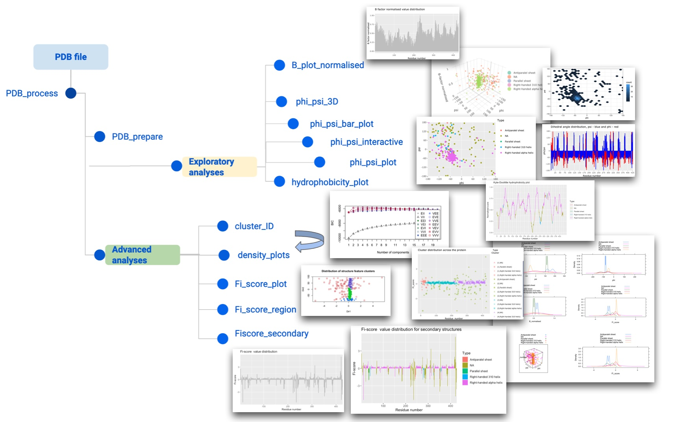

# Fiscore Package: Effective protein structural data visualisation and exploration

author: Austė Kanapeckaitė
date: 8/28/2021

## 1. Package Overview

`Fiscore` is an R package developed to quickly take advantage of protein topology assessment and perform various analyses or integrate derived scores into relational databases as well as machine learning pipelines. The package builds on protein structure and topology studies [1]⁠,⁠ which led to the derivation of Fi-score or mathematical equation that captures dihedral angle and B-factor parameter influence on amino acid residues in a protein.
Target evaluation is paramount for rational therapeutics development [2,3]⁠. For example, to successfully engineer therapeutic antibodies, it is necessary to characterise potential binding or contact sites on target proteins [4,5]⁠. Moreover, translating structural data into parameters that can be used to classify targets, store target-ligand information, or perform machine learning tasks could significantly improve our ability to assess new targets and develop novel therapeutics [2,6,7]⁠. As a result, Fi-score, a first-of-its-kind *in silico* protein fingerprinting approach based on the dihedral angle and B-factor distribution, was used to develop an integrative package to probe binding sites and sites of structural importance [1]⁠. 
`Fiscore` package provides customisable options to explore targets of interest as well as interactive plots to assess individual amino acid parameters. Moreover, user-friendly machine learning pipeline for Gaussian Mixture Models (GMM) allows a robust structural analysis. 

## 2. Package functions

## 3. Key features

The described methodology and the introduced package can be integrated  with other tools and machine learning models. This analysis could aid in the identification of new target families. The described fingerprinting is a novel way to capture protein data since it does not rely on  the  sequence  information but actually measures physicochemical properties of sites of interest.  `Fiscore` package provides both analytical and visualisation tools to interactively assess protein structural files and  capture relevant amino acid interactions over a selected span of a protein sequence. This strategy can become especially relevant in the pharmaceutical industry and drug discovery as more complex targets and protein-protein interactions need to be assessed [1-5].
`Fiscore` package contains a number of useful functions that, for example, can be used to plot interactive Ramachandran plots or 3D visualisations with normalised B-factor values. `Fiscore` package also introduces an easy implementation of machine learning that does not require prior knowledge. Moreover, the described hydrophobicity evaluation and plotting functionality offers a new tool for protein structure assessment connecting the hydrophobic features with the secondary structure elements. This could be useful in deciding what region might be a good binding pocket for a drug. 
Finally, Fi-scores from multiple targets or selected protein domains can be aggregated and used in relational databases to associate a specific physicochemical protein feature with additional experimental readouts or bioassay data.

## 4. Package comments

The package has the following dependencies: `Bio3D`, `plotly`, `ggplot2`, `mclust`, `stringr`, `lattice`, `stats`, `methods`, `dplyr`,`knitr`, `rmarkdown`.

Please note that plotly is used to build interactive plots which will appear on the Viewer tab in RStudio.

Version: v0.1.3

Github page: https://github.com/Algorithm379/Packages/

CRAN: https://cran.r-project.org/web/packages/available_packages_by_name.html#available-packages-F

Inquiries: auste.kan [at] algorithm379 [.] com

# References

1. Kanapeckaitė A, Beaurivage C, Hancock M & Verschueren E (2020) Fi-score: a novel approach to characterise protein topology and aid in drug discovery studies. J Biomol Struct Dyn, 1–11. 

2. Fauman EB, Rai BK & Huang ES (2011) Structure-based druggability assessment-identifying suitable targets for small molecule therapeutics. Curr Opin Chem Biol 15, 463–468.

3. Schmidtke P & Barril X (2010) Understanding and predicting druggability. A high-throughput method for detection of drug binding sites. J Med Chem 53, 5858–5867.

4. Shin S-M, Choi D-K, Jung K, Bae J, Kim J, Park S, Song K-H & Kim Y-S (2017) Antibody targeting intracellular oncogenic Ras mutants exerts anti-tumour effects after systemic administration. Nat Commun 8, 15090.

5. Norman RA, Ambrosetti F, Bonvin AMJJ, Colwell LJ, Kelm S, Kumar S & Krawczyk K (2020) Computational approaches to therapeutic antibody design: Established methods and emerging trends. Brief Bioinform 21, 1549–1567.

6. Obradovic Z, Peng K, Vucetic S, Radivojac P, Brown CJ & Dunker AK (2003) Predicting Intrinsic Disorder From Amino Acid Sequence. In Proteins: Structure, Function and Genetics pp. 566–572.

7. Weisel M, Proschak E, Kriegl JM & Schneider G (2009) Form follows function: Shape analysis of protein cavities for receptor-based drug design. Proteomics 9, 451–459.

